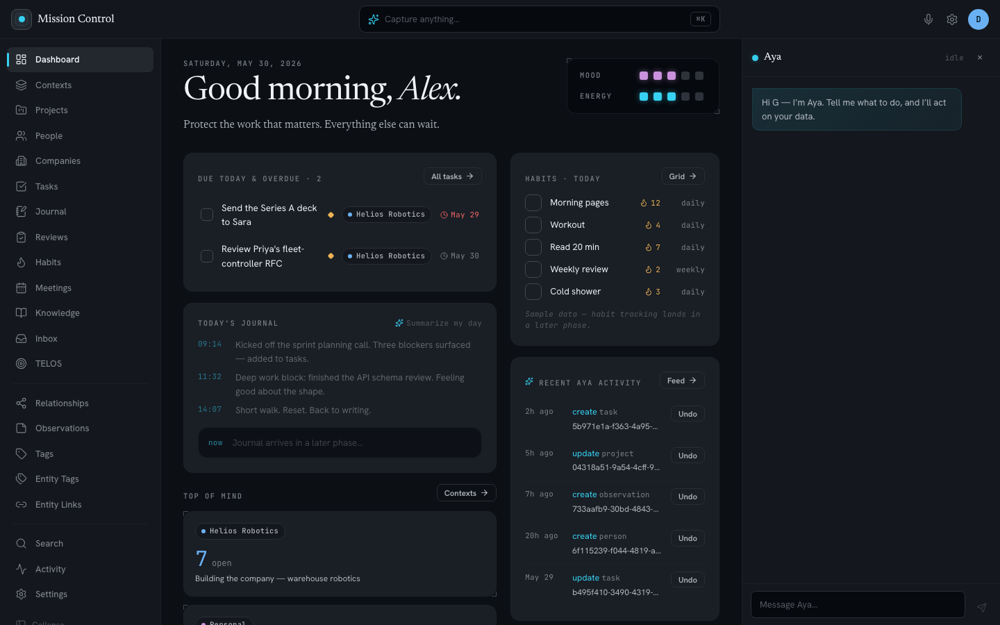

# mission-control

A single-user, self-hosted web app to track and manage life across all devices — the successor to the `aya` markdown vault. Postgres-canonical data, a Neo4j graph projection, pgvector search, and an AI agent that queries and mutates the same data.



> The screenshot above and the `seed-demo` fixtures use an entirely fictional persona — no real personal data.

- **Full specification:** [`SPEC.md`](SPEC.md)
- **Architecture review:** [`docs/REVIEW-2026-05-30.md`](docs/REVIEW-2026-05-30.md)
- **Implementation plans:** [`docs/superpowers/plans/`](docs/superpowers/plans/)

## Status

| Phase | What | State |
|---|---|---|
| P0.1 | Backend foundations — FastAPI + SQLAlchemy 2.0 async + Alembic, Postgres + pgvector, auth, seed CLI | done |
| P0.2 | Frontend shell — Vite + React + TanStack Router/Query + Tailwind v4, login → dashboard | done |
| P0.3 | Deploy infra — Dockerfiles (api, worker, frontend), Caddy with `/api` strip, compose `deploy` profile | done |
| P1 | All 10 domain entities + audit/undo + full CRUD pages + `task_link` | done |
| P3 | Semantic search — pgvector, synchronous inline indexing, `/search` endpoint + global search UI | done |
| P4 | Neo4j graph — outbox → projector → Neo4j, `/graph/query`, `/admin/rebuild-graph`, worker | done |
| P5 | AI agent — `agent_run`, pluggable LLM (`mock` default + OpenAI provider billed to a ChatGPT subscription via Codex device-code OAuth), `/agent/chat` + `/agent/capture`, whole-run undo, Aya dock + ⌘K wired | done |
| P6 | Aya importer — `scripts/import_aya.py`, ran live (~298 people, 343 observations, 27 tasks, 8 companies, 5 contexts, 2 projects) | done |
| P2+ | Journal/meetings/knowledge/inbox/TELOS/tones/reviews entities + pages, passkeys (WebAuthn), list pagination, Console restyle, a11y focus, configurable Soul persona | done¹ |

Backend: 234 tests. Frontend: 65 tests. Alembic head: `0029`. CI green on `main`.

¹ Remaining gaps from the post-merge audit (2026-06-06): the TELOS & Tones pages still use light-theme Tailwind (missed the Console restyle pass); the dashboard Mood/Energy gauges are UI-only (not yet persisted to `journal_entry.mood`/`energy`); `0014_chunk` hardcodes the embedding dim; `tag` entities aren't indexed for search.

## Stack

| Layer | Tech |
|---|---|
| Frontend | React + TypeScript, Vite, TanStack Router/Query, Tailwind v4, Vitest |
| Backend | Python 3.12, FastAPI, SQLAlchemy 2.0 async, Alembic |
| Data | PostgreSQL 16 + pgvector, Neo4j 5 |
| AI | OpenAI Responses tool-use loop billed to a ChatGPT subscription via Codex device-code OAuth (`mock` by default; `openai_oauth` provider via env) |
| Tooling | uv, ruff, mypy, pnpm/npm, GitHub Actions |

## Prerequisites

- Docker (Postgres and Neo4j run in containers) — Docker Desktop, OrbStack, or colima
- [uv](https://docs.astral.sh/uv/) (Python 3.12)
- Node 20.19+ / 22+ and npm

## Run it locally

```bash
# 1. Start Postgres (with pgvector) and Neo4j
docker compose up -d --wait postgres neo4j
docker compose exec -T postgres psql -U mc -d mc -c "CREATE DATABASE mc_test;" || true

# 2. Backend: migrate, seed your user, run the API
cd backend
uv sync
uv run alembic upgrade head
uv run python -m app.cli seed-user --email you@example.com --password changeme --name You
# …or load a ready-made fictional demo dataset (safe to screenshot/share):
#   uv run python -m app.cli seed-demo          # login: demo@missioncontrol.app / demo12345
uv run uvicorn app.main:app --port 8000        # http://localhost:8000  (/health, /auth/*)

# 3. Graph worker (in another terminal — drains outbox events into Neo4j)
cd backend
uv run python -m app.graph.worker

# 4. Frontend (in another terminal): the dev server proxies /api to :8000
cd frontend
npm install
npm run dev                                     # http://localhost:5173
```

Open http://localhost:5173, sign in with the seeded credentials, and you land on the dashboard.

## Run the AI agent

The agent uses a deterministic `mock` LLM by default — no auth required, works out of the box.

To bill model calls to your **ChatGPT subscription** (OpenAI "Sign in with ChatGPT" / Codex device-code OAuth — no per-token API key):

```bash
cd backend

# 1. Authenticate once — prints a URL + code; approve in your browser
uv run python -m app.cli auth-openai
uv run python -m app.cli auth-status            # verify the stored credential

# 2. Run the API with the OpenAI provider
LLM_PROVIDER=openai_oauth LLM_MODEL=gpt-5.5 uv run uvicorn app.main:app --port 8000
```

The token is stored in Postgres (`oauth_credential`) and refreshed automatically. Which models you can call depends on your ChatGPT plan — base models such as `gpt-5.5` work on paid plans, while Codex-specific models (`gpt-5*-codex`) require Plus/Pro. This reuses Codex's OAuth client and the private `chatgpt.com/backend-api/codex` endpoint; it is **unofficial** and outside OpenAI's supported use — see [`docs/superpowers/specs/2026-05-30-openai-oauth-agent-design.md`](docs/superpowers/specs/2026-05-30-openai-oauth-agent-design.md) for the full design and risks.

The agent is accessible via the Aya dock at the bottom of the UI, the ⌘K quick-capture bar, and directly via `POST /agent/chat` and `POST /agent/capture`.

## Graph

Neo4j is required for the `/graph/query` endpoint and the graph view on person pages.

```bash
# Neo4j should already be running from the compose up above
# Rebuild the full graph projection from Postgres (run once after import, or to repair):
curl -X POST http://localhost:8000/admin/rebuild-graph

# The worker keeps it in sync during normal operation:
cd backend && uv run python -m app.graph.worker
```

The graph answers queries like "who do I know at X?" and "how am I connected to Y?" via parameterised Cypher helpers exposed at `POST /graph/query`.

## Import your aya vault

```bash
cd backend
uv run python -m scripts.import_aya --vault ~/brain/aya

# After the import, rebuild the search index and graph:
curl -X POST http://localhost:8000/admin/reindex
curl -X POST http://localhost:8000/admin/rebuild-graph
```

The importer is idempotent (upsert by slug); it is safe to re-run. It imports people, observations, tasks, companies, contexts, projects, and more. Unresolved links and unparsed files are reported at the end without failing the whole run.

Semantic search defaults to a deterministic offline embedder (`EMBEDDINGS_PROVIDER=fake`) so the app runs and tests stay fully offline. To use real OpenAI embeddings instead, set in `.env`:

```bash
EMBEDDINGS_PROVIDER=openai
OPENAI_API_KEY=sk-...   # a standard embeddings key — NOT the Codex/ChatGPT-subscription OAuth credential, which is chat-only
# EMBEDDINGS_MODEL defaults to text-embedding-3-small (EMBEDDINGS_DIM=1536)
```

The `openai` package ships with the backend, so no extra install is needed. After switching the provider, rebuild the search index so existing rows are re-embedded:

```bash
curl -X POST http://localhost:8000/admin/reindex
```

## Deploy

A `deploy` Docker Compose profile brings up the full production stack (api, worker, frontend, postgres, neo4j, caddy):

```bash
cp .env.example .env   # fill in secrets
docker compose --profile deploy up -d
```

Caddy terminates TLS automatically (ACME/Let's Encrypt) and uses `handle_path /api` to strip the `/api` prefix before forwarding requests to the FastAPI container. The frontend SPA adds the `/api` prefix in its fetch client; the Vite dev proxy does the same in development.

Volumes: Postgres data, Neo4j data, attachments. Neo4j is rebuildable from Postgres (`/admin/rebuild-graph`), so only Postgres and attachments are on the backup-critical path.

## Tests & checks

```bash
# Backend
cd backend && uv run pytest -v && uv run ruff check . && uv run mypy app

# Frontend
cd frontend && npm run test -- --run && npm run lint && npm run typecheck && npm run build
```

CI (`.github/workflows/ci.yml`) runs both suites on push/PR.

## Layout

```
backend/    FastAPI app, SQLAlchemy models, Alembic migrations, services, CLI, tests
frontend/   Vite SPA: routes/, components/, lib/ (api client + auth hooks)
docs/       SPEC + architecture review + implementation plans
docker-compose.yml   Postgres + pgvector + Neo4j; deploy profile adds api/worker/frontend/caddy
```

## License

Licensed under the [Apache License 2.0](LICENSE).
